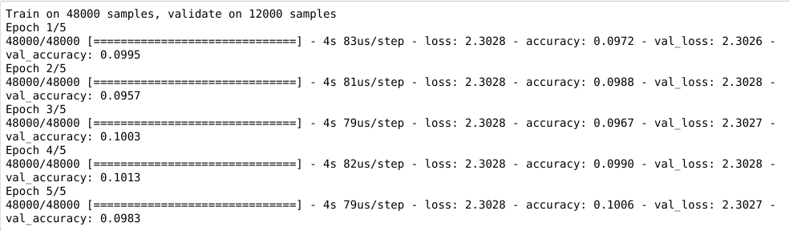
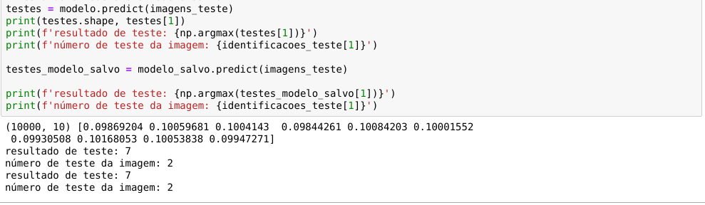

## Introdução

Esse relatório tem como objetivo fazer um overview explicando os processos utilizados do inicío até o fim de um treinamento utilizando o Keras. Futuramente será feito um relatório entrando em detalhes mais profundos como parâmetros, algorítmos de perda/ otimização e etc.

Keras é uma API de redes neurais de alto nível, escrita em Python e capaz de executar sobre TensorFlow, CNTK ou Theano.

## Datasets

Antes de iniciar, é preciso escolher um dataset. O próprio Keras já disponibiliza alguns:

- __boston_housing module__: Conjunto de dados de regressão do preço da habitação em Boston.

- __cifar10 module__: Conjunto de dados de classificação de imagens pequenas CIFAR10 (60000 imagens coloridas de 32 x 32 em 10 classes, com 6000 imagens por classe).

- __cifar100 module__: Conjunto de dados de classificação de imagens pequenas CIFAR100 (assim como o CIFAR-10, exceto que possui 100 classes contendo 600 imagens cada).

- __fashion_mnist module__: Dataset Fashion-MNIST (conjunto de dados das imagens dos itens da loja __Zalando__ - consistindo em um conjunto de treinamento de 60.000 exemplos e um conjunto de testes de 10.000 exemplos. Cada exemplo é uma imagem em escala de cinza de 28 x 28, associada a um rótulo de 10 classes).

- __imdb module__: Conjunto de dados de classificação de sentimentos do IMDB.

- __mnist module__: Conjunto de dados de dígitos manuscritos MNIST.

- __reuters module__: Conjunto de dados de classificação de tópicos da __Reuters__.

Para o curso foi utilizado o __fashion_mnist module__.

## Sequential 

O modelo Sequencial (__keras.Sequential__) é uma pilha linear de camadas.

É possível criar um modelo seqüencial passando uma lista de instâncias de camada para o construtor:

    modelo = keras.Sequential([
        # Camada de entrada
        keras.layers.Flatten(input_shape = (28,28)), # As imagens, de 28 por 28 pixels (input_shape = tamanho das entradas).
        
        # Processamento (camada do tipo dense,
        keras.layers.Dense(256, activation = tf.nn.relu), # => Não há um número exato, ele deve ser testado e ajustado.

        # 'Adormecer' alguns itens, normalizando o modelo
        keras.layers.Dropout(0.2),
        
        # Saida
        keras.layers.Dense(10, activation = tf.nn.softmax), # => Aqui eu coloco 10 porque eu tenho 10 tipos de categorias.
    ])

Os modelos em Keras são definidos como uma sequência de camadas.

### Camada Flatten

O __keras.Flatten__ basicamente _nivela a entrada_. Achatar um tensor significa remover todas as dimensões, exceto uma. É exatamente isso que a camada __Flatten__ faz.

### Camada Dense

Conforme a documentação, _Apenas a sua camada NN comum, densamente conectada_ (NN = neural network). Ou seja, a cadada _core_. É a implementação da equação:

    output = activation(dot(input, kernel) + bias)

Isso significa que estamos pegando o produto escalar entre nosso tensor de entrada e qualquer que seja a matriz de núcleo de peso que esteja presente em nossa camada densa. Em seguida, adicionamos um vetor de viés  e realizamos uma ativação por elemento dos valores de saída (__relu no nosso caso__).

### Dropout

Aplica o Dropout à entrada.

O __Dropout__ (abandono) consiste em definir aleatoriamente uma taxa de fração das unidades de entrada como 0 a cada atualização durante o tempo de treinamento, o que ajuda a evitar o ajuste excessivo (overfitting).

__Overfitting:__ Quando um modelo é treinado com muitos dados, ele começa a aprender com o ruído e as entradas de dados imprecisas em nosso conjunto de dados. Em seguida, o modelo não categoriza os dados corretamente, devido a muitos detalhes e ruídos.

## Compile

Antes de treinar um modelo, é preciso configurar o processo de aprendizado, que é feito pelo método de compilação. Ele recebe três argumentos:

- __Um otimizador (optimizer)__. Pode ser o identificador de sequência de um otimizador existente (como rmsprop ou adagrad) ou uma instância da classe Optimizer. 

- __Uma função de perda (loss)__. Esse é o objetivo que o modelo tentará minimizar. Pode ser o identificador de sequência de uma função de perda existente (como categorical_crossentropy ou mse) ou pode ser uma função objetiva. 

- __Uma lista de métricas (metrics)__. Para qualquer problema de classificação, defina isso como métricas = ['precisão']. Uma métrica pode ser o identificador de sequência de uma métrica existente ou uma função de métrica personalizada. 

        modelo.compile(
            # Otimizador
            optimizer=adam, 
            
            # Função de perda
            loss='sparse_categorical_crossentropy',
            
            # métricas
            metrics=['accuracy']
        )

## Training (fit)

Após configurar e compilar o modelo, fazemos o treinamento dele com o __.fit__. Conforme a documentação: _Treina o modelo para um número fixo de épocas (iterações em um conjunto de dados)._

O retorno é um objeto _History_. Seu atributo __History.history__ é um registro de valores de perda de treinamento e valores de métricas em épocas sucessivas, bem como valores de perda de validação e valores de métricas de validação.

    historico = modelo.fit(imagens_treino, identificacoes_treino, epochs=5, validation_split=0.2)

## Predict

Por fim, após toda a parte custosa do Deep Learning ter sido finalizada, podemos fazer as predições usando nosso modelo com o __.predict__ . Segundo a documentação, o predict:

    Gera previsões de saída para as amostras de entrada.

## Referências

[1] https://keras.io/

[2] https://www.dobitaobyte.com.br/rede-neural-com-keras-mais-anotacoes/

[3] https://stackoverflow.com/questions/43237124/what-is-the-role-of-flatten-in-keras

[4] https://medium.com/@hunterheidenreich/understanding-keras-dense-layers-2abadff9b990