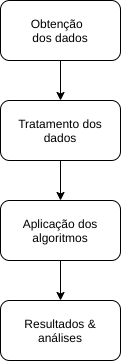
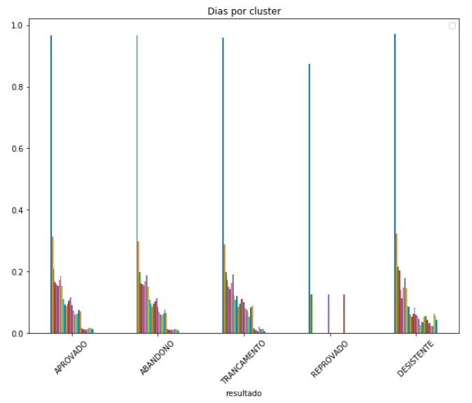

## Introdução

// TODO

## Trabalho proposto

// TODO

O seguinte trabalho propõe um modelo que tenta verificar a relação mais eficaz entre a efetiva participação do aluno num curso vs dias passados, de forma a verificar após quantos dias um aluno que não realizou nenhuma atividade está a determinada porcentagem de evadir. 

Para isso o seguinte pipeline foi elaborado e seguido:

### Obtenção dos dados

Os dados foram obtidos a partir de alunos da Escola virtual do governo, com dados que vão de fevereiro de 2018 à janeiro de 2019. São dados brutos, que incluem diversos atributos como sexo, uf, tipo de servidor dentre outros. Posteriormente também foi trabalhado outro dataset, com dados de logs de acesso. Tais dados incluíam data de acesso, id da matricula e onde o acesso foi realizado. Ao final do curso um aluno pode obter um dos seguintes resultados:

|sit_matricula	|Descrição|
|--|--|
| APROVADO | Representa o aluno que foi aprovado no curso|
| CERTIFICADO | Representa o aluno que foi aprovado no curso e recebeu o certificado|
| CANC_DESISTENTE | Representa o aluno que por algum motivo trancou/cancelou o curso|
| REPROVADO | Representa o aluno que fez o curso porém obteve média final inferior à 60 pontos|
| DESISTENTE | Representa o aluno que chegou a fazer algumas provas, porém não finalizou o curso|
| ABANDONO | Representa o aluno que não chegou a fazer nenhuma prova |

Porém, para fins de simplificação, nessa análise APROVADO e CERTIFICADO se tornam aprovado e CANC_DESISTENTE se torna TRANCAMENTO. 

#### Perfil de acesso dos alunos

Um ponto interessante, e que baseia boa parte desse artigo, são os acessos dos alunos ao curso. Na imagem abaixo, cada cor de uma linha representa um dia, que vai desde o dia 0 (momento da matrícula) até o 30º dia, visto que um aluno tem até um mês para realizar o curso após a sua inscrição.

Como pode-se observar, alunos aprovados e alunos que abandonaram o curso possuem um comportamento de acesso muito similar, considerando-se a média entre os grupos. Tal fato se mostra atípico, visto que para um aluno obter o resultado de abandono ele não fez nenhuma atividade avaliativa, o que pode demonstrar uma desatenção dos alunos.

### Tratamento dos dados:

Antes de aplicar os algoritmos de aprendizagem automática, é necessário antes preparar os dados. Para isso alguns dados que previamente foram identificados como errôneos são removidos. Tais dados vão desde alunos alunos sem notas de provas com status aprovado à alunos que realizaram as provas após 1 mês da data de matrícula (o que não é permitido).  

Na sequência é feita a remoção de colunas que não serão utilizadas. Tais colunas indicam dados desnecessários, como id da disciplina (único, logo o valor é repetido por todo o dataset) e notas máximas das atividades (sempre 100), e iriam influenciar negativamente os algoritmos.

__Conversão de todas as datas em datetime e adição de valores padrões de datas para NaN/null__, a fim de evitar problemas futuros com a aplicação dos algoritmos. A data padrão inserida caso o valor esteja ausente é 2000-01-01 00:00:00. A data foi intencionalmente inserida, visto que ao calcular a diferença entre ela e o dia de matricula de um aluno sempre irá resultar em dias negativos, facilitando a manilupação posterior que será feita.

// TODO

- Adição das colunas dias entre atividade X e matrícula

- Adição das colunas de atividades feitas até dia N

- Tratamento de dados ausentes para demais colunas

- Encode no dataset inteiro com custom class

- Normalização dos dados

### Aplicação do algoritmo

Após o tratamento dos dados foram utilizados os seguintes algoritmos:

- LinearSVC
- GaussianNB
- RandomForestClassifier
- AdaBoostClassifier
- LogisticRegression
- DecisionTreeClassifier

Todos algoritmos classificadores, visto que pela natureza do nosso problema temos um problema de classificação, onde preciso determinar qual o possível resultado de um aluno. Foi utilizado gridSearch para melhorar a tunagem de hiperparâmetros.

Para a aplicação com os dados de acesso (logs) os seguintes dados foram obtidos:

|Dias|LinearSVC	|GaussianNB	|RandomForest	|AdaBoost	|LogisticRegression	|DecisionTree|
|--|--|--|--|--|--|--|
|3|81.07|80.33|81.36|80.80|80.91|81.02|
|5|85.13|69.68|85.09|84.86|85.02|85.25|
|7|88.60|78.80|88.64|88.58|88.67|88.62|
|9|90.74|89.05|90.64|90.62|90.71|90.60|

Já sem os dados de acesso (logs) foram obtidos os seguintes resultados

|Dias|LinearSVC	|GaussianNB	|RandomForest	|AdaBoost	|LogisticRegression	|DecisionTree|
|--|--|--|--|--|--|--|
|3|81.25|81.36|81.06|80.95|80.59|81.04|
|5|85.47|85.56|85.29|85.52|85.42|85.05|
|7|88.90|88.29|88.95|88.90|88.90|88.92|
|9|90.99|90.84|90.97|90.90|90.99|91.15|

## Resultados & análise

Não há diferença aparente nos algoritmos com ou sem os dados de acesso (logs). Isso pode acontecer pelo fato alunos aprovados e alunos que abandonaram o curso terem comportamento de acesso similares nos primeiros dias, o que evidencia:

1. Que os alunos aprovados começam a realizar as atividades avaliativas tardiamente (geralmente após uma semana desde o momento da mátricula), ou:
2. Que os alunos considerados evadidos (sit_matricula abandono) acessam o sistema e assistem as aulas, porém por algum motivo adverso não fazem as atividades avaliativas.

Em ambos os casos, uma solução seria alertar os alunos que não fizeram nenhuma atividade avaliativa após um período de dias. Esse período pode ser determinado a partir da análise acurácia x dias após a matricula, onde o gestor ou agente público irá determinar o quão efetivo ele pretende ser (acurácia) ou após quantos dias já pretende agir.
