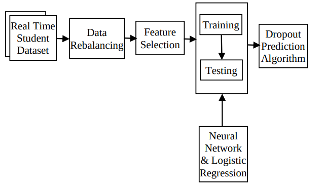
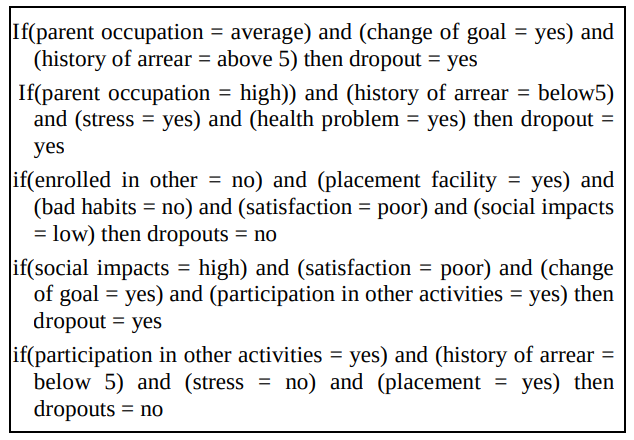

## Resumo

O ___paper___ fala sobre o problema da evasão escolar, citando o fato de que o índice de evasão escolar na Índia chega a quase 16%. Com base nisso e dados coletados de diversas faculdades eles propõem um algoritmo de Previsão de Desistência (_Dropout Prediction Algorithm_ - DPA) usando [lógica difusa](../glossario/funcoes.html#conceitos-diversos) e um sistema de inferência baseado em [regressão logística](../glossario/funcoes.html#logistica)

### Trabalho proposto

Como o comportamento e dados dos alunos são coletados de diversas fontes, alguns dados podem ser multidimensionais (ter diferentes dimensões e/ou escalas para o mesmo tipo de dado), o que requer um pré-processamento dos dados. Dessa forma, são aplicadas técnicas de mineração de dados (data mining) para extrair as _features_ (variáveis de entrada) que influenciam na performance do estudante e no sistema educacional. 

As features extraídas são dadas para a fase de treinamento, e uma vez completo o modelo aprende o estado e obtém resultados precisos.

O algoritmo proposto pelo _paper_ é obtido de acordo com o seguinte diagrama:

Fonte: [_Paper_](#referencias)

Seguindo os seguintes passos:

 - __Coleta de dados (_Data Collection_)__: Foram coletadas 300 amostras de dados de estudantes para os cenários de evasão

 - __Limpeza de dados (_Data Cleansing_)__: Foi utilizada filtragem por instância utilizando o algoritmo SMOTE (Synthetic Minority Over-sampling Technique) e a ferramenta [Weka](https://www.cs.waikato.ac.nz/ml/weka/) para a filtragem por atributo.

 - __Seleção de features (_Feature Selection_)__: Após os passos acima, todas as informações sobre a evasão foram reduzidas para 23 features, as quais foram filtradas usando algoritmos de seleção de atributo (_CfsSubsetEval_, _ChiSquaredAttributeEval_, dentre outros). Ao final os atributos selecionados foram: __Ocupação dos pais__, __se o aluno participa ou não de atividades extra-curriculares__, __nível de satisfação__, __mudança de curso__, __instituição__, __stress__, __localização__, __ambiente__, __histórico de atrasos__ e __maus hábitos__.

 - __Classificação de amostras (_Classification of Samples_)__: Foram utilizadas árvores de decisão e regressão logistica para a previsão de evasão.

 - __Previsão de desistência (_Dropout Prediction_)__: As regras para aprevisão de evasão foram elaboradas utilizando-se um sistema de inferência difusa. O seguinte algoritmo de predição foi feito:

 .

 Após a execução dos passos acima, os seguintes resultados foram obtidos:
|Algorithm |TP|
|--|--|
|NaïveBayes| 0.892|
|Multilayer Perceptron| 0.784 |
|RBFNetwork |0.919|
|LogisticRegression |0.973 |
|SMO |0.919 |
|AdaBoost| 0.973 |
|DecisionStump |0.973 |
|NBtree| 0.865 |
|JRip |0.919|
|Ridor| 0.892|

Onde TP = True positive.

## Referências

A. Saranya, J. Rajeswari - [ENHANCED PREDICTION OF STUDENT DROPOUTS USING FUZZY INFERENCE SYSTEM AND LOGISTIC REGRESSION](http://ictactjournals.in/paper/IJSC_Vol_6_Iss_2_paper_7_1157_1162.pdf) - Department of Information Technology, Adhiparasakthi Engineering College, India

Wikipédia - [Lógica Difusa](https://pt.wikipedia.org/wiki/L%C3%B3gica_difusa)