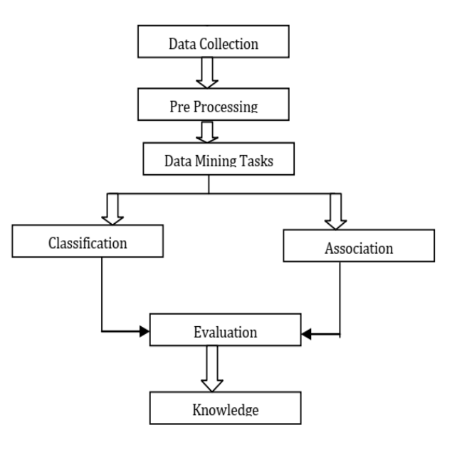
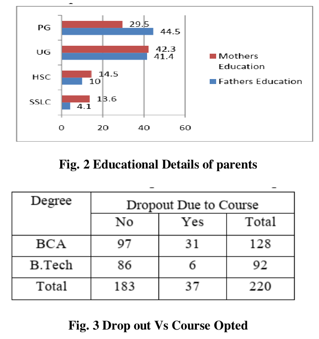
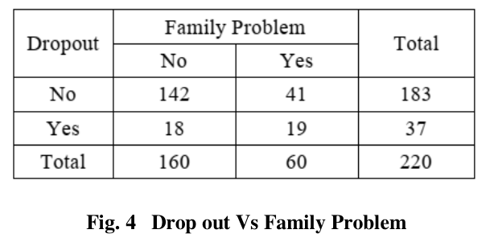

## Resumo

_Um modelo eficiente para prever o abandono do aluno usando técnicas de mineração de dados e aprendizado de máquina_ (tradução livre)

O paper fala sobre um modelo de predição de evasão escolar utilizando __Mineração de dados__ e técnicas de __aprendizado de máquina__. Apesar de ter certo foco na mineração de dados, ele também traz pontos interessantes sobre as aplicações de algoritmos de aprendizado de máquina utilizando árvores de decisão

### Trabalho proposto

Durante o desenvolvimento do paper, foram pesquisados diversos parâmetros relacionados aos estudantes para a aplicação das técnicas de aprendizado de máquina. Dentre os diversos parâmetros, foram escolhidos:

- __Histórico familiar__
- __Ganho financeiro da família__
- __Atividades sociais__
- __Empenho ambiental do aluno__

Dentre alguns outros.

Fonte: [_Paper_](#referencias)

Após a escolha dos parâmetros é realizado a preparação dos dados, onde foi feita uma pesquisa com diversos estudantes (não é citado em qual ou quais instituições). os dados coletados são então analisados e classificados. A classificação é feita utilizando algoritmos de árvore de decisão. os seguintes resultados foram obtidos:

Fonte: [_Paper_](#referencias)

Onde:

BCA = __Bachelor in Computer Application__,  
B.Tech =  __Bachelor of Technology__,  
SSLC = __Secondary School Certificate__,  
HSC = __Higher Secondary school Certificate__,  
UG = __under graduate__,   
PG = __post graduation__

Na prática, não se verifica uma relação muito forte entre problemas familiares e evasão escolar.

## Referências

Mercy Paul Selvan, Nagubadi. Navadurga, Nimmagadda. Lakshmi Prasanna - [An Efficient Model for Predicting Student Dropout using Data Mining and Machine Learning Techniques](https://www.ijitee.org/wp-content/uploads/papers/v8i9S2/I11550789S219.pdf) - International Journal of Innovative Technology and Exploring Engineering (IJITEE)
