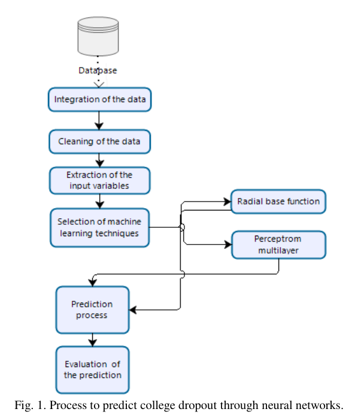

## Resumo 

_Redes neurais para prever desistências nas universidades_ (tradução livre)

O _paper_ fala sobre o problema da evasão escolar nas universidades, e como um sistema de predição dessa evasão permite que os administradores de universade possam ter um melhor conhecimento sobre a situação num âmbito mais geral, além de permitir que ações mais enfáticas sejam tomadas de forma a evitar esse quadro. A pesquisa apresenta uma abordagem de rede neural através da aplicação de algoritmos de [perceptrom multicamada](https://scikit-learn.org/stable/modules/generated/sklearn.neural_network.MLPClassifier.html) e [função de base radial](https://scikit-learn.org/stable/modules/generated/sklearn.gaussian_process.kernels.RBF.html), levando em consideração 11 features de entrada que impactam negativamente os alunos.

### Trabalho proposto

Fonte: [_Paper_](#referencias)

O trabalho propõe um pipeline que vai desde a obtenção dos dados até a análise dos resultados, utilizando dois algoritmos de aprendizagem profunda. O dataset utilizado corresponde às informações coletadas de 2670 alunos matriculados nos cursos de Administração e Ciencias Humanas de Universidades pública do Equador no período de 2014 a 2017. Após a coleta dos dados há um processo de limpeza dos mesmos, onde dados redundantes e em branco, por exemplo, são removidos para garantir uma melhor qualidade ao processo de predição.

Na sequência dois algoritmos de aprendizado profundo são escolhidos e aplicados: [perceptrom multicamada](https://scikit-learn.org/stable/modules/generated/sklearn.neural_network.MLPClassifier.html) e [função de base radial](https://scikit-learn.org/stable/modules/generated/sklearn.gaussian_process.kernels.RBF.html), obtendo assim a acurácia para os dois modelos.

#### Pré-processamento dos dados

As features foram selecionadas com base no peso e importância delas, ambos determinados através de um rankeamento: 

|--|Atributo:|
|--|--|
|1| Conhecimento limitado sobre software especializado nas principais universidades |
|2| Gravidez planejada e / não planejada |
|3| Compromisso do professor com o aluno |
|4| Compromisso financeiro do filho primogênito com sua família |
|5| Assédio moral |
|6| Sexismo |
|7| Estudantes adquiriram vícios |
|8| Número de filhos do aluno |
|9| Adaptação do aluno à aprendizagem universitária |
|10| Classificação do major ou da instituição |
|11| Perspectiva do aluno sobre sua integração no mercado de trabalho |

#### Arquitetura do modelo

Na arquitetura do modelo, foi considerado o número mínimo de unidades da camada oculta 1 e um valor máximo das unidades da camada oculta 50. Para o processo de treinamento da rede neural, foi utilizada a [__função logarítmica sigmóide__](). Além disso, a [__entropia cruzada__]() foi usada como uma [__função de erro__](). Já nas camadas ocultas foi utilizada uma [__função de ativação softmax__](). Ao final, os seguintes resultados foram obtidos:

|Neural Networks |Training |Testing|
|--|--|--|
|Perceptrom Multilayer| 96,3%| 98,6%|
|Function de Base Radial |96,8% |98,1%|

Ou seja, não foram obtidas diferenças perceptivas entre os modelos escolhidos.

## Referências

Mayra Alban, David Mauricio - [Neural Networks to Predict Dropout at the Universities](http://www.ijmlc.org/vol9/779-ML0074.pdf) - International Journal of Machine Learning and Computing, Vol. 9, No. 2, April 2019

