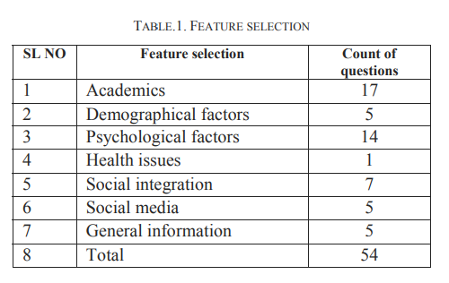
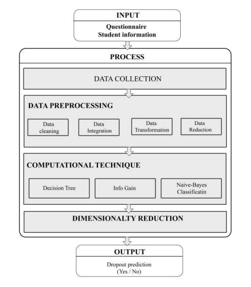
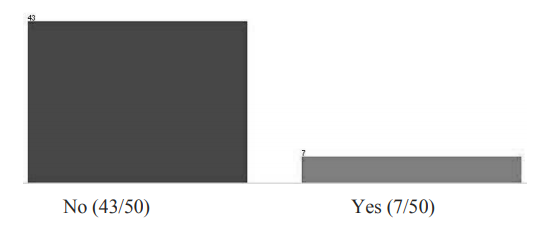

## Resumo

_Previsão e análise do abandono de alunos do ensino superior por meio da mineração de dados educacionais_ (tradução livre)

O _paper_ apresenta um  modelo para a predição de evasão escolar utilizando algoritmos de florestas de decisão e Naive-bayes na linguagem R, procurando também as razões que levam à evasão. 

### Trabalho proposto 

Os dados foram coletados através de aplicações de questionários, onde houve a seguinte distribuição de perguntas por tema:

Fonte: [_Paper_](#referencias)

Para o passo de extração de atributos foram utlizadas técnicas como como __identificação de fatores__, __elaboração de questionário de pesquisa__, __coleta de fatos dos registros acadêmicos__, __redução de dimensionalidade__, dentre outros.

O modelo proposto foi feito a partir de uma estrutura pré-definida, conforme a imagem abaixo:

Fonte: [_Paper_](#referencias)

Os algoritmos utilizados foram __Naive-Bayes__ e __Decision Tree__ (dito como um dos algoritmos mais bem sucedidos para classificações), e dois questionários foram criados e aplicados: um pré questionário (para os alunos que acabaram de entrar na escola) e um pós questionário (para alunos que continuaram na escola). A ideia da aplicação de 2 questionários em momentos diferentes é distinguir o ponto de vista de um aluno que acabou de entrar do ponto de vista de um aluno que continuou no curso. Após a aplicação dos questionários utilizando o __google forms__, a redução de dimensionalidade tem um peso importante para reduzir o tamanho dos atributos que serão armazenados no banco.

Também são aplicadas técnicas de pré-processamento dos dados com o intuito de verificar dependências entre os atributos. Quatro técnicas principais foram utilizadas: 

 - Limpeza dos dados
 - Transformação dos dados
 - Integração dos dados
 - Redução dos dados

Na sequência há a aplicação dos algoritmos utilizando a linguagem de programação __R__, devido sua velocidade, onde os seguintes resultados foram obtidos:

Fonte: [_Paper_](#referencias)

Onde 36 instâncias foram classificadas corretamente e 14 não (72% de acerto). 

### Conclusão 

O paper conclui que caso o alunos tenha mais do que 4 falhas em matérias, mais de 3 faltas, se sofre de algum tipo de problema de saúde e não se adaptou ao ambiente ele irá evadir.

## Refêrencias

Vinayak Hegde, Prageeth P P - [Higher education student dropout prediction and analysis through educational data mining](https://ieeexplore-ieee-org.ez54.periodicos.capes.gov.br/stamp/stamp.jsp?tp=&arnumber=8398887) - Department of Computer Science Amrita School of Arts and Sciences, Amrita Vishwa Vidyapeetham, Mysuru Campus Mysuru, India