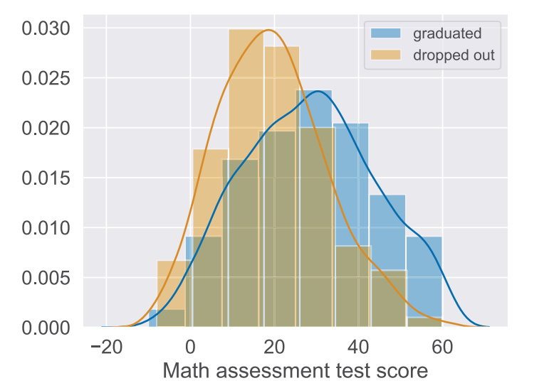
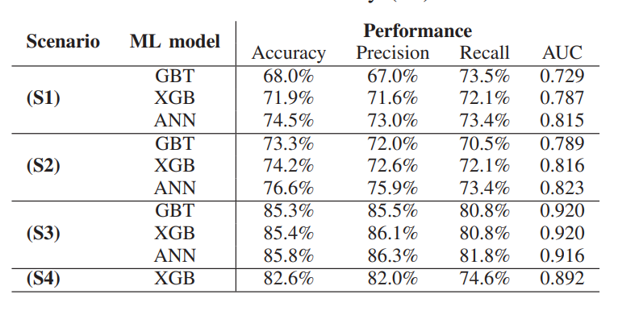
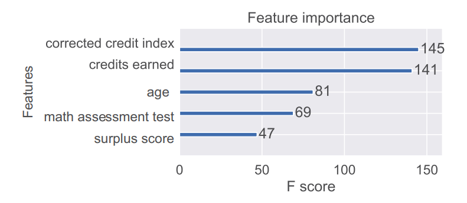

## Resumo 

_Prevendo o abandono escolar usando as medidas de desempenho acadêmico do ensino médio e do primeiro semestre_ (tradução livre)

O paper se propõe a elaborar um modelo de predição de evasão escolar, focando principalmente nas disciplinas _STEM_ (termo em inglês para agrupar as disciplinas de ciência, tecnologia, engenharia e matemática), com ênfase em dados antes da entrada do aluno na universidade e também dados do primeiro semestre letivo.

### Trabalho proposto 

O projeto se inicia com a obtenção dos dados. É dito no paper que há vários campos com dados ausentes, o que necessitará de um ajuste, porém os dados não estão desbalanceados. Os atributos dos dados podem ser resumidos em 4 grandes categorias:

- Dados relacionados ao programa universitário (se o aluno se rematriculou, status, campo de estudo, dentre outros)
- Desempenho do ensino médio
- Indicadores de desempenho universitário (ou dados do primeiro semestre letivo)
- Informações pessoais (idade, gênero, dentre outros).

Fonte: [_Paper_](#referencias)

#### Metodologia e resultados

Como diversas entradas continham dados ausentes, foi necessária a aplicaçãode algumas técnicas como o cálculo de médias.Os dados ausentes eram, em sua maioria, informações sobre notas do ensino médio. Para os dados categóricos foi utilizado _one-hot encode_ para a conversão em dados numéricos. Também foram utilizadas técnicas como k-NN, MissForest, MICE e fatoração matricial.

Foram projetados 4 cenários para a avaliação:

- S1: usando dados disponíveis no momento da inscrição;
- S2: S1 com dados da primeira semana;
- S3: Todos os dados disponíveis;
- S4: Somente dados relacionados ao primeiro semestre.

E 3 algoritmos de aprendizagem supervisionada foram utilizados (ditos como os mais bem sucedidos em estudos de EDM anteriores): __Gradient Boosted Trees (GBT)__, __eXtreme Gradient Boosting (XGB)__ e __artificial neural networks (ANN)__. Para evitar o sobreajuste, as redes neurais foram utilizadas com somente uma camada oculta. Nos modelos de ML foi utilizada otimização de hiperparâmetros com grid Search e validação cruzada.Os seguintes resultados foram obtidos:

Fonte: [_Paper_](#referencias)

E as 5 variáveis mais importantes para a avaliação, de acordo com o XGBoost pode ser visto abaixo: 

Fonte: [_Paper_](#referencias)

Onde F-score significa quantas vezes o algoritmo usou um determinado recurso para dividir dados durante a construção de árvores de decisão

## Referências

Botond Kiss∗, Marcell Nagy†, Roland Molontay‡ and Balint Csabay - [Predicting Dropout Using High School and First-semester Academic Achievement Measures](https://ieeexplore-ieee-org.ez54.periodicos.capes.gov.br/stamp/stamp.jsp?tp=&arnumber=9040158) - Department of Stochastics, Budapest University of Technology and Economics, Budapest, Hungary
