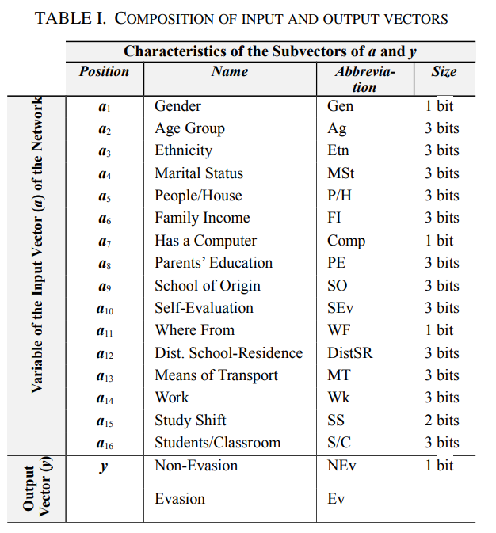
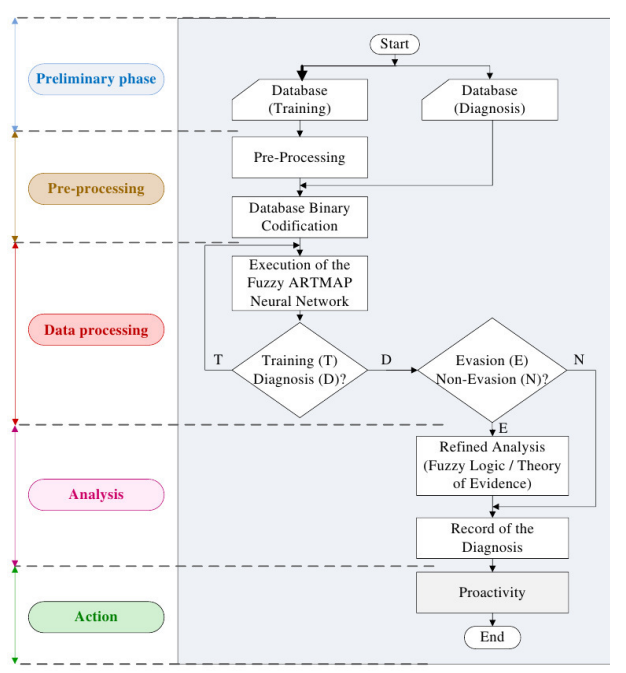
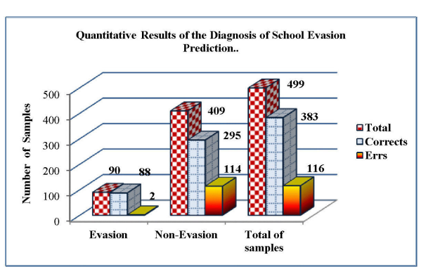

## Resumo 

_Previsão do grupo de risco de evasão escolar usando Redes Neurais_ (tradução livre)

### Trabalho proposto 

O paper exibe o desenvolvimento de um modelo para a previsão de evasão escolar utilizando a Rede Neural Fuzzy-ARTMAP, uma das técnicas de inteligência artificial, com possibilidade de aprendizado contínuo.

#### Metodologia e resultados

Os dados foram obtidos através de histórico escolar dos alunos no universo de interesse, (alunos matriculados nas Faculdades de Tecnologia (CT) em Automação e Controle Industrial, Obras de Controle, Sistemas de Internet, Redes de Computadores e Secretário Executivo do IFMT). sendo 1650 amostras de trainamento e 499 para diagnose. O vetor de entrada da rede neural Fuzzy ARTMAP é composto por 16 parâmetros considerados significativos para a previsão de evasão escolar e o resultado da rede constituído por duas classes, evasão e não evasão.

Fonte: [_Paper_](#referencias)

As informações no dataset são então pré-processadas e convertidas em binários. Na fase de análise, se uma resposta é negativa em relação à evasão nada é feito. Do contrário, há um refinamento na análise com base no uso do módulo Fuzzy e / ou na __Teoria das evidências de Dempster-Shafer__.

Fonte: [_Paper_](#referencias)

E os seguintes resultados são obtidos:

Fonte: [_Paper_](#referencias)

Ou seja, o algoritmo consegue prever com precisão a possibilidade de evasão, mas tem certa dificuldade na previsão de uma não-evasão.

## Referências

Valquíria R. C., Clodoaldo Nunes, Carlos Roberto Minussi - [Prediction of school dropout risk group using Neural Network](https://ieeexplore-ieee-org.ez54.periodicos.capes.gov.br/stamp/stamp.jsp?tp=&arnumber=6643984&tag=1) - Department of Informatics - Federal Institute of Mato Grosso
