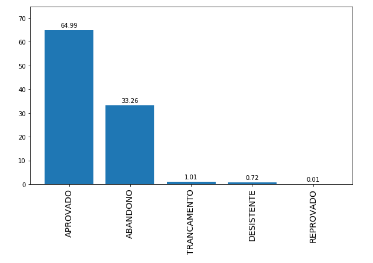

## A seção

Essa seção tem por objetivo compilar ideias de vários artigos, procurando pontos em comum para a elaboração de todo um pipeline para a predição de evasão escolar. Elas serão divididas numa sequência lógica, que vai desde a coleta dos dados até a avaliação dos resultados. As ideias aqui listadas não necessariamente serão seguidas no projeto, porém podem servir de norte.

## O Pipeline

### Coleta & análise dos dados

Apesar de alguns papers aplicarem questionários, boa parte deles obtém os dados através de históricos escolares dos alunos. A partir disso há uma série de dados com vários atributos, dentre os quais costumam se destacar:

 - Notas das disciplinas dos alunos
 - Renda familiar
 - Sexo & sexismo 

Uma das preocupações observadas nos papers é ter que lidar com distribuições de classes desequilibradas, ou seja: um conjunto de dados com uma grande quantidade de alunos aprovados e poucos alunos desistentes (ou vice-versa), o que dificulta o treinamento, aplicação e análise dos algoritmos de aprendizado de máquina. No caso do dataset que usaremos isso é parcialmente aplicável. Há uma maioria de alunos com resultado "aprovado", porém é uma situação melhor do que 90/10%.

Fonte: Dataset.

#### Sobre algumas conclusões

Alguns pontos chaves são levantados em alguns papers:

- No paper [___Consideration of the Local Correlation of Learning Behaviors to Predict Dropouts from MOOCs___](https://ieeexplore-ieee-org.ez54.periodicos.capes.gov.br/stamp/stamp.jsp?tp=&arnumber=8858088), parte dos dados consiste no registro de cliques e logs do usuário e do server (e quais páginas foram acessadas, como a wiki por exemplo). Um ponto interessante levantado aqui é que somente _20% dos alunos_ irão continuar com o mesmo padrão de aprendizagem após 30 dias, e o abandono escolar é denotado pela falta de comportamentos de aprendizagem dos alunos nos primeiros 10 dias (por exemplo, não acessar mais a wiki ou nada em geral).

- Já no paper [___Predicting Dropout Using High School and First-semester Academic Achievement Measures___](https://ieeexplore-ieee-org.ez54.periodicos.capes.gov.br/stamp/stamp.jsp?tp=&arnumber=9040158&tag=1) temos a informação de que alguns fatores que influenciam a evasão já são conhecidos logo na primeira semana, como morar ou não no campus e atributos relacionados a um teste de avaliação matemática aplicado também na primeira semana. No caso do teste de matemática, os resultados permitem concluir que, em média, os graduados alcançam pontuações mais altas no teste de matemática do que os desistentes. Também pode-se levar em conta a nota do exame aplicado para entrar na academia.

- O paper [___Mining Educational Data to Predict Academic Dropouts: a Case Study in Blended Learning Course___](https://ieeexplore-ieee-org.ez54.periodicos.capes.gov.br/stamp/stamp.jsp?tp=&arnumber=8650138), num cenário específico, lista 4 critérios que podem ser analisados para verificar a possível evasão de um aluno: 
    - __Frequência de tentativas de um questionário__,
    - __Duração da tentativa de um questionário__,
    - __Número de atividades do questionário__,
    - __Número de tentativas de questionários__;

### Pré-processamento dos dados

Apesar de ser um passo com grandes variações a depender dos datasets e quantidade de atributos obtidos, algumas técnicas são comumente observadas, dentre as quais:

 - Normalização dos atributos
 - Reescalamento dos dados (redução de dimensionalidade)
 - Seleção de atributos
 - Conversão de abributos categóricos em atributos numéricos (com one-hot enconde, por exemplo)
 - No caso de universidades, a nota de exames preparatórios (equivalentes ao enem ou vestibular, por exemplo)

O pré-processamento dos dados é um passo importante a ser feito antes de aplicação dos algoritmos, pois influencia diretamente na performance dos mesmos, facilitando a convergência de alguns e reduzindo a necessidade de processamento computacional no geral.

Um dos problemas comumente observado é ter que lidar com os dados ausentes. Há uma série de coisas que podem ser feitas nesse caso. O paper [___Predicting Dropout Using High School and First-semester Academic Achievement Measures___](https://ieeexplore-ieee-org.ez54.periodicos.capes.gov.br/stamp/stamp.jsp?tp=&arnumber=9040158&tag=1), por exemplo, lista a utlização de __k-NN__ (K-Nearest Neighbors), __MissForest__ (linguagem R. O equivalente com o scikit learn é o __ExtraTreesRegressor__), __MICE__ (multiple imputaiton by chained equations) e __fatoração matricial__ (matrix factorization)

### Treinamento e seleção dos algoritmos

Como o problema de evasão escolar é um problema de classificação, na maioria das vezes binário (desistente ou não, por exemplo), os algoritmos utilizados são algoritmos de classificação. Diversos algoritmos de aprendizado de máquina e aprendizado profundo são utilizados, porém os algoritmos de árvore de decisão e métodos ensemble são comumente referenciados. Dentre os algoritmos listados podemos destacar:

 - Gradient Boosted Trees (ensemble),
 - Decision Tree,
 - Naive-Bayes,
 - AdaBoost,
 - JRip
 - RandomForest

A seleção dos hiper-parâmetros também costuma ser feita com o uso de Grid Search.

### Avaliação dos resultados

Antes de ser feita a avaliação dos resultados, os papers citam uma divisão do dataset em 3 ou mais partes. No geral a divisão é feita em: conjunto de treinamento, conjunto de teste e conjunto de validação cruzada. Essa divisão ocorre para que os modelos elaborados possam ser de fato avaliados, verificando a existência ou não de problemas como o sobre-ajuste. 

As métricas mais usadas para a avaliação dos resultados são __precisão__ e __matriz de confusão__, mas não é incomum o uso de __curvas ROC__.

