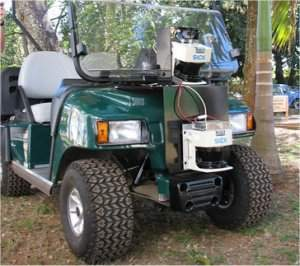
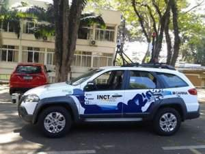
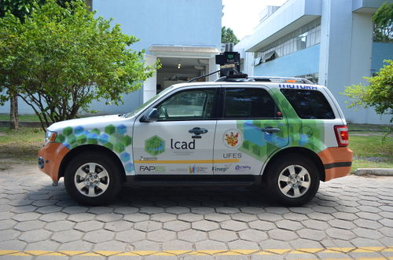
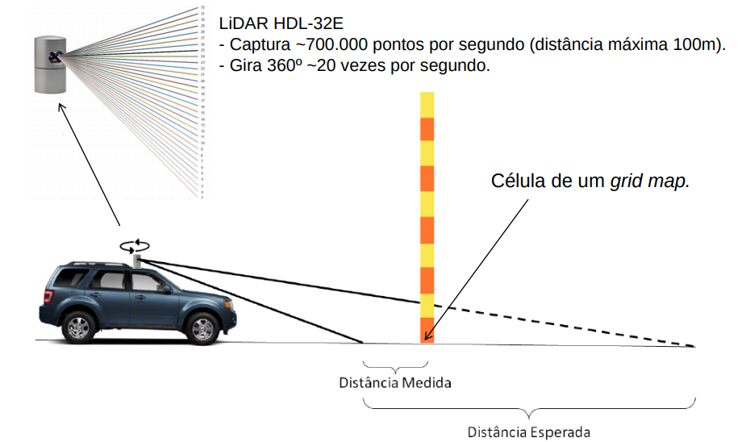
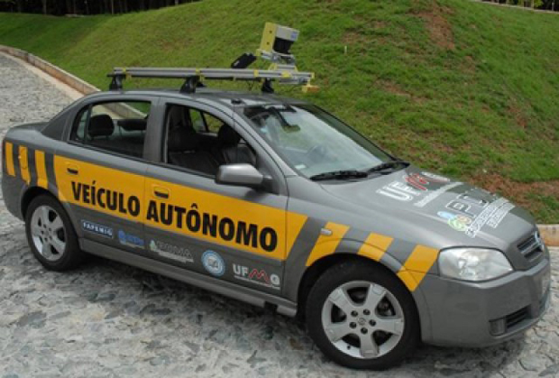
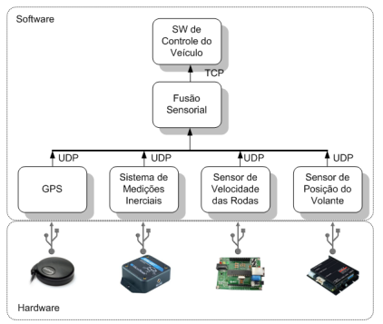

Seção em desenvolvimento. Tem como objetivo mapear as principais iniciativas voltadas para o desenvolvimento de veículos autônomos no Brasil.

## Laboratório de Robótica Móvel - Universidade de São Paulo(USP)

### Carina 1 

Projeto iniciado em 2010. Consistia de um carrinho de golfe com uma pequena suíte de sensores: uma câmera monocular, e sensores LIDAR 2D

### Carina 2

O projeto Carina 2 teve inicio em 2011. Dessa vez foi utilizado um Fiat Palio Adventure equipado com câmeras estéreo, LIDAR 3D (32-beam), RADARs, GPS com correção RTK (Real Time Kinematic) e um IMU (Inertial measurement unit):

- 1 __Bumblebee XB3 1 Firewire stereo camera with 16 fps__,1280×960 resolution, 3.8 mm focal length (66-deg horizontal field of view) and color image.
- 1 __Velodyne HDL-32E 3D laser scanner 2 operating at 10Hz__, 2cm accuracy, 32 Channels, 80m−100m range, 700, 000 points per second, 360◦ horizontal field-ofview and ±20◦ vertical field-of-view.
- 1 __Commercial bi-mode MMW RADAR (76.5 GHz), Delphi ESR 3 operating at 20Hz__ with ±10◦ field-ofview with range of 174m and ±45◦ with range of 60m.
- 1 __Septentrio AsteRx2eH GPS 4 operating at 10Hz with RTK correction__ signals and two antenna.

O Carina 2 realizou um teste nas ruas de São Carlos pela primeira vez em 2013, 

### Outros projetos e pesquisas

Enquanto realizada o desenvolvimento do projeto Carina, o grupo de pesquisadores também realizou pesquisas em diversos tópicos como __detecção de objetos__, __detecção de estradas__, __rastreamento veicular__, __assistência ao condutor__ (driver assistance) e controles autônomos e simulações.

Uma das conclusões obtidas foi a realização de que os datasets atuais (para o momento da pesquisa) não refletiam cenários encontrados no Brasil (como as condições precárias de estradas por exemplo).

Dentre as pesquisas podemos citar: 

- [Automatic Mapping of Urban Environments](http://ieeexplore.ieee.org/xpl/articleDetails.jsp?arnumber=7024263)
- [Controle de Veículos Autônomos](https://ieeexplore.ieee.org/document/7795574)
- [Curb and road marking detection for vehicle localization](http://lrm.icmc.usp.br/web/index.php?n=Port.ProjLoc)
- [Obstacle Detection and Segmentation](http://ppniv15.irccyn.ec-nantes.fr/material/session3/Ridel/paper.pdf)
- [Road Detection Using Deep Learning](https://ieeexplore.ieee.org/document/7487486/)
- [Detecção de Obstáculos e Vias](http://ppniv15.irccyn.ec-nantes.fr/PPNIV15_Proceedings.pdf)
- [Framework de Simulação para Veículos e Direção Assistiva](http://lrm.icmc.usp.br/web/index.php?n=Port.ProjSimul)

Há também um projeto sobre um [caminhão autônomo](http://www.lrm.icmc.usp.br/web/index.php?n=Port.ProjSTruck), apesar de poucos detalhes serem ditos.

Artigo relacionado:

-(CARINA) P. Y. Shinzato et al., "CaRINA dataset: An emerging-country urban scenario benchmark for road detection systems," 2016 IEEE 19th International Conference on Intelligent Transportation Systems (ITSC), Rio de Janeiro, 2016, pp. 41-46, doi: 10.1109/ITSC.2016.7795529.

## Laboratório de Computação de Alto Desempenho (LCAD) - Universidade Federal do Espírito Santo - UFES

### Intelligent Autonomous Robotic Automobile - IARA

O Projeto IARA utiliza um carro Ford Escape Hybrid com diversos sensores de alto nível:

- 2 Grey Bumblebee XB3 stereo cameras e 2 Point Grey Bumblebee 2 stereo cameras
- Light Detection and Ranging (LIDAR) Velodyne HDL 32-E
- GPS-aided Attitude and Heading Reference System (AHRS/GPS) Xsens MTiG

Para o processamento dos dados que vêm dos sensores são utilizados até 4 Dell Precision R5500 (2 Intel Xeon 2.13 GHZ, 12 GB RAM, 2 HDs SSD of 120GB on RAID0 and GPU cards Tesla C2050)

Para o sistema de Localização e Mapeamento Simultâneos (SLAM) foi criado um sistema próprio baseado no FastSLAM e mapas do google, e para o reconhecimento de placas de trânsito foi utilizado VG-RAM WNN (Virtual Generalizing Random Access Memory Weightless Neural Network)

O IARA realizou um teste em 2017, rodando 74km de Vitória para Guarapari.

Links úteis: 

- https://www2.camara.leg.br/atividade-legislativa/comissoes/comissoes-permanentes/cvt/audiencias-publicas/audiencias-publicas-2018/arquivos-de-eventos/ap-22-05-2018-14h/ap-22-05-2018-14h-prof-alberto-souza-ufes
- https://www.ufes.br/conteudo/carro-aut%C3%B4nomo-da-ufes-realiza-viagem-in%C3%A9dita-at%C3%A9-guarapari
- http://www.lcad.inf.ufes.br/wiki/index.php/IARA

## Grupo de Pesquisa e Desenvolvimento de Veículos Autônomos (PDVA) - Universidade Federal de Minas Gerais (UFMG)

### CADU

O projeto CADU (Carro Autônomo Desenvolvido na UFMG) utiliza um Chevrolet Astra Sedan 2003 e os seguintes sensores:

- GPS Garmin modelo GPS18
- IMU (Sistema de Medições Inerciais) 3DM-GX1 - Microstrain
- controlador EPOS 25/5 (Sensor de orientação das rodas dianteiras)
- Microcontrolador Microship PIC18F2550 (Sensor de velocidade das rodas)

Links úteis: 
- http://www.cpdee.ufmg.br/~palhares/cba2012-2.pdf
- http://www.coro.cpdee.ufmg.br/publications/vitor_sabbagh.pdf

## Outros

- Equipe do Veículo Autônomo (EVA): do Departamento de Engenharia de Transportes da Escola Politécnica da Universidade de São Paulo
    - https://www.teses.usp.br/teses/disponiveis/3/3138/tde-26082015-161805/publico/DISSERTACAO_RODRIGOPISSARDINI_Password_Removed.pdf

- __SENA  Sistema Embarcado de Navegação Autônoma__: Um sistema desenvolvido no Laboratório de Robótica Móvel (USP) cujo objetivo principal é o desenvolvimento de um veículo com capacidade de se locomover de forma semi-autônoma
    - https://bv.fapesp.br/pt/bolsas/111134/sena-sistema-embarcado-de-navegacao-autonoma-navegador-para-ambientes-urbanos/

- Carro autônomo da UNIFEI/UFJF
    - https://conexaoitajuba.com.br/unifei-desenvolve-veiculo-inteligente/
    - https://www.ufjf.br/arquivodenoticias/2010/04/carro-autonomo-e-apresentado-na-ufjf/
- e.coTech4
    - https://www.hitech-e.com.br/
    - https://www.istoedinheiro.com.br/brasileira-hitech-electric-lanca-carro-autonomo-eletrico-em-parceria-com-a-positivo/